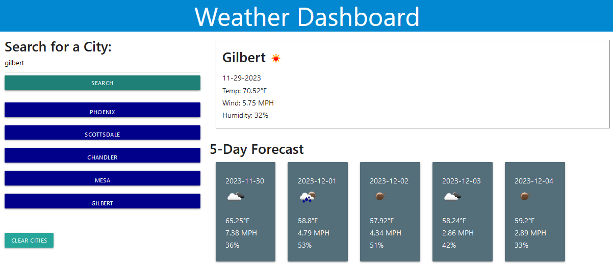

# weather-dashboard
Displays weather information using the OpenWeather API's

## Description
This is a weather dashbaord that displays the current weather and the weather in a 5 day forecast. It was built using Materialize CSS framework, DayJS, jQuery, and vanilla HTML, CSS, and JavaScript. I built this app so that a traveler can view multiple cities and plan a trip accordingly. I learned the concept of consuming server-side API's and using their responses as data in my application. Other concepts that were reinforced in this project are: function modularity, objects as data structures, and dynamically creating HTML elements.

## Usage
To use this application, navigate to this URL and search for a city.

## API's Used

1. [Search By City](http://api.openweathermap.org/geo/1.0/direct?q={city name},{state code},{country code}&limit={limit}&appid={API key})
2. [Search for 5 Day Forecast with Coordinates](api.openweathermap.org/data/2.5/forecast?lat={lat}&lon={lon}&appid={API key})
3. [Search for Current Weather with Coordinates](http://api.openweathermap.org/geo/1.0/reverse?lat={lat}&lon={lon}&limit={limit}&appid={API key})

## Screenshot

